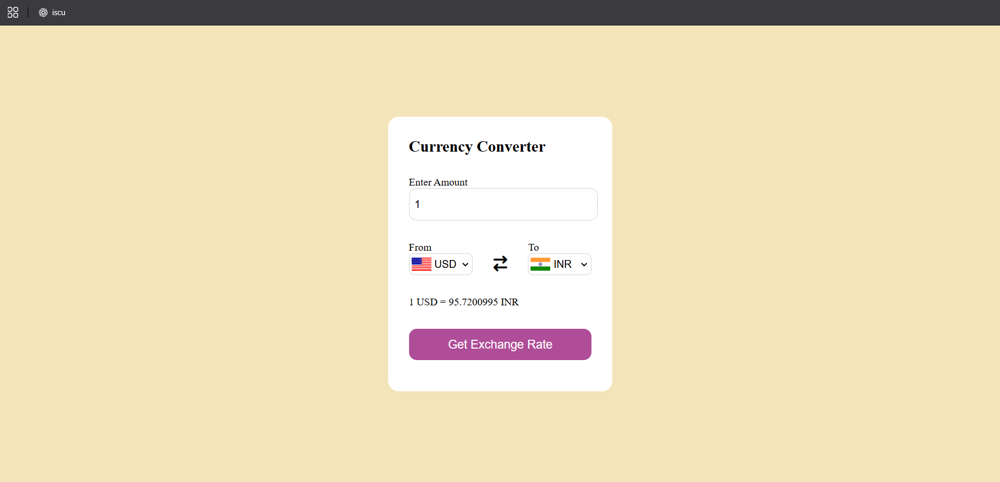

# 💱 Currency Converter

A responsive Currency Converter web application built using HTML, CSS, and JavaScript that allows users to convert one currency into another with real-time exchange rate support.

## 🚀 Live Demo
https://currency-converter-akhilesh.netlify.app
## 📌 Features
- Convert currency values instantly
- Real-time currency conversion
- Dynamic country flag updates
- Responsive UI
- API-based exchange rates

## 🛠️ Tech Stack
- HTML5
- CSS3
- JavaScript
- Fetch API

## 📂 Project Structure
currency-converter/
│── index.html
│── style.css
│── app.js
│── codes.js

## 📸 Preview

## 🧠 What I Learned
While building this project, I improved my understanding of:
- DOM Manipulation
- Event Handling
- API Fetching
- Async JavaScript
- Dynamic UI Updates
- Working with JSON data
- 
## 👨‍💻 Author
**Akhilesh Sharma**

LinkedIn:  
https://www.linkedin.com/in/akhilesh-sharma07/

GitHub:  
https://github.com/akhileshx07
